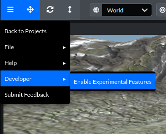

## Creating Custom Elements

The structure of elements are described in the [Elements](./README.md#Elements) section of the docs. You should read that before getting started. In this tutorial we'll go into how to create a more advanced element, a spinning textured cube.

To get started we'll create a new file, `SpinningCubeNode.js`, in the `src/editor/nodes` directory. This class will represent our node in the 3D scene.

We'll import the `EditorNodeMixin` which wraps our `Mesh` in a class with Spoke specific lifecycle methods and more. Then we'll fill in the required parts of the `SpinningCubeNode` class.

```js
import { Mesh, MeshBasicMaterial, BoxBufferGeometry } from "three";
import EditorNodeMixin from "./EditorNodeMixin";

export default class SpinningCubeNode extends EditorNodeMixin(Mesh) {
  static componentName = "spinning-cube";

  static nodeName = "Spinning Cube";

  constructor(editor) {
    super(editor, new BoxBufferGeometry(), new MeshBasicMaterial());
  }

  serialize() {
    return super.serialize({
      [SpinningCubeNode.componentName]: {}
    });
  }
}
```

`componentName` will be used in the default `deserialize` method which we'll extend later. We also use it in the `serialize` method which we have to add the component to ourselves.

`nodeName` is used in the editor UI and should be the human-readable name of this element.

The constructor will be the constructor for the `Object3D` that we are applying the mixin to, `Mesh` in this case, and it will also need `editor` to be passed in as the first argument. The `EditorNodeMixin` uses this internally and your custom element will as well. We'll just pass arguments to create a basic cube.

We'll stop there for now with the node class and move onto the node editor.

Create a new file, `SpinningCubeNodeEditor` in `src/ui/properties`.

This file will be a React component that should use the `<NodeEditor>` component as it's root element. The rest of the editor properties will be added as children of this element.

```js
import React from "react";
import NodeEditor from "./NodeEditor";
import { Cube } from "styled-icons/fa-solid/Cube";

export default function SpinningCubeNodeEditor(props) {
  return <NodeEditor {...props} description={SpinningCubeNodeEditor.description} />;
}

SpinningCubeNodeEditor.iconComponent = Cube;

SpinningCubeNodeEditor.description =
  "It's a cube! And it spins!";
```

`SpinningCubeNodeEditor.iconComponent` is a static property of the component class that will be used to display the icon for this given component throughout the editor. We're using `Cube` which isn't great because the `ModelNodeEditor` uses it as well, but for the purposes of this tutorial, it'll work.

`SpinningCubeNodeEditor.description` will be used to display a description for this element in the assets panel and properties panel. Feel free to set your own description 😅

That's pretty much it for the minimal node editor. Now let's go and register this element in `src/config.js`, not to be confused with `src/configs.js` which is used for managing server related configuration variables.

```js
// ...

// Add these imports
import SpinningCubeNode from "./editor/nodes/SpinningCubeNode";
import SpinningCubeNodeEditor from "./ui/properties/SpinningCubeNodeEditor";

export function createEditor(api, settings) {
  

  const editor = new Editor(api, settings);
  
  // ...

  // And call editor.registerNode with our node class and editor component.
  editor.registerNode(SpinningCubeNode, SpinningCubeNodeEditor);

  // ...

}
```

Now we can fire up Spoke with `yarn start` and create a new project. We should see the Spinning Cube in the assets panel. And we should be able to add it to our scene and move it around. You can save your project, reload it, and it should still be there. And you can even export it as a glb or publish it to the Hubs dev server. Awesome!

But it doesn't spin yet!

Spoke has a "preview mode" as an experimental feature. Let's go an enable that in our editor



You'll then see the preview scene button in your toolbar.


When you you can click the button to run the update loop on any supported components in Spoke and get a better feel for what your scene will look like in Hubs. It's not a 1-to-1 preview since there is an export process in the middle, but it should get close for all the supported elements.

Let's make it so we can preview this cube spinning in the editor.

```js
// We'll import Euler for use below
import { Mesh, MeshBasicMaterial, BoxBufferGeometry, Euler } from "three";
import EditorNodeMixin from "./EditorNodeMixin";

export default class SpinningCubeNode extends EditorNodeMixin(Mesh) {
  static componentName = "spinning-cube";

  static nodeName = "Spinning Cube";

  constructor(editor) {
    super(editor, new BoxBufferGeometry(), new MeshBasicMaterial());

    // Add this variable to store the rotation when entering and exiting preview mode
    this.originalRotation = new Euler();
  }

  // This method is called when the editor enters preview mode.
  onPlay() {
    // We'll store the original rotation so we can reset it when we pause the editor.
    this.originalRotation.copy(this.rotation);
  }

  // This method is called every frame, when the editor is paused or playing.
  onUpdate(dt) {
    // Rotate the cube dt radians on the y axis when the editor is in play mode.
    if (this.editor.playing) {
      this.rotation.y += dt;
    }
  }

  // This method is called when you pause preview mode.
  onPause() {
    // Reset the object to its original rotation
    this.rotation.copy(this.originalRotation);
  }

  serialize() {
    return super.serialize({
      [SpinningCubeNode.componentName]: {}
    });
  }
}
```

With those few additions you should see the cube spin when you press play!

Now let's make it so we can set the speed. To do this we'll need a new property on the object and we also need to serialize/deserialize the property when we save/load the project.

```js
// Note we'll need to import the Math class from three, but it conflicts with the browser's Math class so we'll map it to MathUtils
import { Mesh, MeshBasicMaterial, BoxBufferGeometry, Euler, Math as MathUtils } from "three";
import EditorNodeMixin from "./EditorNodeMixin";

export default class SpinningCubeNode extends EditorNodeMixin(Mesh) {
  static componentName = "spinning-cube";

  static nodeName = "Spinning Cube";

  // When we load the Spoke project we need to load this new speed property, so we'll need a custom deserialize function.
  static async deserialize(editor, json) {
    // The default deserializer will set the transform, name, visibility, and other basic properties.
    const node = await super.deserialize(editor, json);

    // json will be the entity object in the Spoke project and components will be an array of the form:
    // { name: "spinning-cube", props: { speed: 10 } }

    const { speed } = json.components.find(c => c.name === SpinningCubeNode.componentName).props;

    // We'll set the object's speed property and default to 10 deg/s if it's undefined.
    node.speed = speed === undefined ? 10 : speed;

    return node;
  }

  constructor(editor) {
    super(editor, new BoxBufferGeometry(), new MeshBasicMaterial());

    // We'll set the default speed to rotate 10 degrees every second.
    this.speed = 10;

    this.originalRotation = new Euler();
  }

  onPlay() {
    this.originalRotation.copy(this.rotation);
  }

  onUpdate(dt) {
    if (this.editor.playing) {
      // Now we can use the speed property
      // Note: rotation.y is in radians so we'll need to convert from degrees to radians
      this.rotation.y += dt * MathUtils.degToRad(this.speed);
    }
  }

  onPause() {
    this.rotation.copy(this.originalRotation);
  }

  serialize() {
    return super.serialize({
      [SpinningCubeNode.componentName]: {
        // We need to serialize this new property to the Spoke project.
        // The contents of this object will get set on the entity's "spinning-node" component
        // { name: "spinning-cube", props: { speed: <speed> } }
        speed: this.speed
      }
    });
  }
}
```

Ok, cool, we've got a speed property that we can adjust to make the cube spin at a different rate. Now we need to be able to set it. Let's add a new field to the node editor component.

```js
import React from "react";
import NodeEditor from "./NodeEditor";
import { Cube } from "styled-icons/fa-solid/Cube";
// Add the following imports
import PropTypes from "prop-types";
import NumericInputGroup from "../inputs/NumericInputGroup";
import useSetPropertySelected from "./useSetPropertySelected";

export default function SpinningCubeNodeEditor(props) {
  // We're passing all of the props to NodeEditor, but we also want to pull out editor and node.
  const { editor, node } = props;
  // useSetPropertySelected is a hook that can be used to set the specified properties on the selected objects.
  const onChangeSpeed = useSetPropertySelected(editor, "speed");

  // Here's a rundown of the NumericInputGroup props:
  // name: The input label
  // smallStep: How much the value adjusts when you hold ctrl + up/down arrows
  // mediumStep: How much the value adjusts when you press the up/down arrows
  // largeStep: How much the value adjusts when you hold shift + up/down arrows
  // value: The speed property of the current active node (last selected)
  // onChange: The setter from above
  // unit: Show the correct units to the user

  return (
    <NodeEditor {...props} description={SpinningCubeNodeEditor.description}>
      <NumericInputGroup
        name="Speed"
        smallStep={0.1}
        mediumStep={1}
        largeStep={10}
        value={node.speed}
        onChange={onChangeSpeed}
        unit="°/s"
      />
    </NodeEditor>
  );
}

SpinningCubeNodeEditor.iconComponent = Cube;

SpinningCubeNodeEditor.description = "It's a cube! And it spins!";

// Make eslint happy with some prop types.
SpinningCubeNodeEditor.propTypes = {
  editor: PropTypes.object.isRequired,
  node: PropTypes.object.isRequired
};
```

With this new editor you should be able to adjust the speed of your spinning cube! Try it out and also try saving/reloading your project.

Next, let's set a texture on the cube. This will introduce us to asynchronously loading an image when deserializing the object and when setting it in the editor.

There's a lot in this step. Loading and using assets can be a little tricky. Hopefully, you get the general idea from the code and comments. If you need more examples, try reading through the nodes in the `src/editor/nodes` directory.

```js
import { Mesh, MeshBasicMaterial, BoxBufferGeometry, Euler, Math as MathUtils } from "three";
import EditorNodeMixin from "./EditorNodeMixin";
// Add the following imports
import { RethrownError } from "../utils/errors";
import { getObjectPerfIssues, maybeAddLargeFileIssue } from "../utils/performance";

export default class SpinningCubeNode extends EditorNodeMixin(Mesh) {
  static componentName = "spinning-cube";

  static nodeName = "Spinning Cube";

  // We'll be using two additional arguments to deserialize
  static async deserialize(editor, json, loadAsync, onError) {
    const node = await super.deserialize(editor, json);

    // Load the textureSrc property out of the props
    const { speed, textureSrc } = json.components.find(c => c.name === SpinningCubeNode.componentName).props;

    node.speed = speed === undefined ? 10 : speed;

    // Spoke will load the texture asynchronously so we don't block other nodes from loading.
    loadAsync(
      (async () => {
        // loadTexture will handle loading the texture and setting the texture src property.
        // onError will be used to handle loading errors asynchronously.
        await node.loadTexture(textureSrc, onError);
      })()
    );

    return node;
  }

  constructor(editor) {
    super(editor, new BoxBufferGeometry(), new MeshBasicMaterial());
    // We're going to be using getter/setters for the textureSrc property.
    // We still need a place to store the textureSrc value so we'll prefix it with an underscore.
    this._textureSrc = "";
    this.speed = 10;
    this.originalRotation = new Euler();
  }

  // Here's our getter, nothing special here.
  get textureSrc() {
    return this._textureSrc;
  }

  // Our setter is going to call this async method.
  set textureSrc(value) {
    this.loadTexture(value).catch(console.error);
  }

  async loadTexture(src, onError) {
    // Make sure if we pass undefined in the deserialize method that we set it to an empty string.
    const nextSrc = src || "";

    // We don't want to load the texture if it hasn't changed.
    if (nextSrc === this._textureSrc) {
      return;
    }

    this._textureSrc = nextSrc;

    // The issues array will be used to highlight any scene performance warnings or problems while loading assets.
    // We need to reset it since we're going to load a new texture.
    this.issues = [];

    try {
      // Textures can be images from all over the web. As such we need to proxy media if it needs proper CORS headers.
      // The resolveMedia function will give us a url that can be accessed in Spoke and metadata for attribution details.
      const { accessibleUrl, meta } = await this.editor.api.resolveMedia(nextSrc);

      this.meta = meta;

      this.updateAttribution();

      // This is where the texture is actually loaded. We use an in-memory cache for textures so that duplicates
      // aren't loaded more than once.
      const texture = await this.editor.textureCache.get(accessibleUrl);

      this.material.map = texture; // Set the texture on the material
      this.material.needsUpdate = true; // Don't forget to set the needsUpdate flag!

      // Here's where we'll add any performance issues with the texture size on this mesh.
      // High resolution textures will display a warning.
      this.issues = getObjectPerfIssues(this, false);

      // The browser has an API to get stats on loading files.
      const perfEntries = performance.getEntriesByName(accessibleUrl);

      if (perfEntries.length > 0) {
        // This is how we check the texture file size.
        // Large image files will also display a warning.
        const imageSize = perfEntries[0].encodedBodySize;
        maybeAddLargeFileIssue("image", imageSize, this.issues);
      }
    } catch (error) {
      // If we ran into an error loading the image, we'll wrap the error with a more user-friendly message.
      const textureError = new RethrownError(`Error loading texture ${this._textureSrc}`, error);

      // Asynchronous error handling when loading the project happens here.
      if (onError) {
        onError(this, textureError);
      }

      console.error(textureError);

      // And we'll want to indicate to the user in the hierarchy panel that there was an error loading the texture.
      this.issues.push({ severity: "error", message: "Error loading texture." });
    }

    // The object changed asynchronously so we'll need to manually trigger an objectsChanged and selectionChanged event.
    // This will update the project modification status as well as the properties panel and other internal editor state.
    this.editor.emit("objectsChanged", [this]);
    this.editor.emit("selectionChanged");

    return this;
  }

  onPlay() {
    this.originalRotation.copy(this.rotation);
  }

  onUpdate(dt) {
    if (this.editor.playing) {
      this.rotation.y += dt * MathUtils.degToRad(this.speed);
    }
  }

  onPause() {
    this.rotation.copy(this.originalRotation);
  }

  serialize() {
    return super.serialize({
      [SpinningCubeNode.componentName]: {
        speed: this.speed,
        // We'll want to serialize this texture url so that it loads next time we load the project.
        textureSrc: this.textureSrc
      }
    });
  }
}
```

And to set the texture url we'll need to add another field to the node editor.

```js
import React from "react";
import NodeEditor from "./NodeEditor";
import { Cube } from "styled-icons/fa-solid/Cube";
import PropTypes from "prop-types";
import NumericInputGroup from "../inputs/NumericInputGroup";
import useSetPropertySelected from "./useSetPropertySelected";
// Add the following imports
import InputGroup from "../inputs/InputGroup";
import ImageInput from "../inputs/ImageInput";
import AttributionNodeEditor from "./AttributionNodeEditor";

export default function SpinningCubeNodeEditor(props) {
  const { editor, node } = props;
  const onChangeSpeed = useSetPropertySelected(editor, "speed");
  // Here we add the new property setter
  const onChangeTextureSrc = useSetPropertySelected(editor, "textureSrc");

  // ImageGroup shows the label for an input and adds the correct margins
  // ImageInput is another input field type that accepts urls for images.
  // You can drag and drop files or assets from the assets panel into this field.
  // The AttributionNodeEditor lets you add additional attribution info to this object.
  // Since we're allowing the user to set a texture from an unknown source, we need to add this.

  return (
    <NodeEditor {...props} description={SpinningCubeNodeEditor.description}>
      <NumericInputGroup
        name="Speed"
        smallStep={0.1}
        mediumStep={1}
        largeStep={10}
        value={node.speed}
        onChange={onChangeSpeed}
        unit="°/s"
      />
      <InputGroup name="Texture Url">
        <ImageInput value={node.textureSrc} onChange={onChangeTextureSrc} />
      </InputGroup>
      <AttributionNodeEditor name="Attribution" {...props} />
    </NodeEditor>
  );
}

SpinningCubeNodeEditor.iconComponent = Cube;

SpinningCubeNodeEditor.description = "It's a cube! And it spins!";

SpinningCubeNodeEditor.propTypes = {
  editor: PropTypes.object.isRequired,
  node: PropTypes.object.isRequired
};
```

Now we should be able to set the texture on the cube!

We're almost done!

We need to make sure that we can duplicate the object and handle exporting the spinning behavior. In fact the two are related. When we export/publish in Spoke we make a duplicate of the entire scene where we can make modifications like de-duplicating objects and removing unnecessary ones.

So let's implement the `copy` function.

```js
import { Mesh, MeshBasicMaterial, BoxBufferGeometry, Euler, Math as MathUtils } from "three";
import EditorNodeMixin from "./EditorNodeMixin";
import { RethrownError } from "../utils/errors";
import { getObjectPerfIssues, maybeAddLargeFileIssue } from "../utils/performance";

export default class SpinningCubeNode extends EditorNodeMixin(Mesh) {
  static componentName = "spinning-cube";

  static nodeName = "Spinning Cube";

  static async deserialize(editor, json, loadAsync, onError) {
    const node = await super.deserialize(editor, json);

    const { speed, textureSrc } = json.components.find(c => c.name === SpinningCubeNode.componentName).props;

    node.speed = speed === undefined ? 10 : speed;

    loadAsync(
      (async () => {
        await node.loadTexture(textureSrc, onError);
      })()
    );

    return node;
  }

  constructor(editor) {
    super(editor, new BoxBufferGeometry(), new MeshBasicMaterial());
    this._textureSrc = "";
    this.speed = 10;
    this.originalRotation = new Euler();
  }

  get textureSrc() {
    return this._textureSrc;
  }

  set textureSrc(value) {
    this.loadTexture(value).catch(console.error);
  }

  async loadTexture(src, onError) {
    const nextSrc = src || "";

    if (nextSrc === this._textureSrc) {
      return;
    }

    this._textureSrc = nextSrc;
    this.issues = [];

    try {
      const { accessibleUrl, meta } = await this.editor.api.resolveMedia(nextSrc);

      this.meta = meta;

      this.updateAttribution();

      const texture = await this.editor.textureCache.get(accessibleUrl);

      this.material.map = texture;
      this.material.needsUpdate = true;

      this.issues = getObjectPerfIssues(this, false);

      const perfEntries = performance.getEntriesByName(accessibleUrl);

      if (perfEntries.length > 0) {
        const imageSize = perfEntries[0].encodedBodySize;
        maybeAddLargeFileIssue("image", imageSize, this.issues);
      }
    } catch (error) {
      const textureError = new RethrownError(`Error loading texture ${this._textureSrc}`, error);

      if (onError) {
        onError(this, textureError);
      }

      console.error(textureError);

      this.issues.push({ severity: "error", message: "Error loading texture." });
    }

    this.editor.emit("objectsChanged", [this]);
    this.editor.emit("selectionChanged");

    return this;
  }

  onPlay() {
    this.originalRotation.copy(this.rotation);
  }

  onUpdate(dt) {
    if (this.editor.playing) {
      this.rotation.y += dt * MathUtils.degToRad(this.speed);
    }
  }

  onPause() {
    this.rotation.copy(this.originalRotation);
  }

  // source is the object we're copying from.
  copy(source, recursive = true) {
    super.copy(source, recursive);

    // A new material is created in the constructor so we'll copy over the texture here.
    this.material.map = source.material.map;

    // We'll also want to copy over the properties we added in this class.
    this._textureSrc = source._textureSrc;
    this.speed = source.speed;

    return this;
  }

  serialize() {
    return super.serialize({
      [SpinningCubeNode.componentName]: {
        speed: this.speed,
        textureSrc: this.textureSrc
      }
    });
  }
}
```

And with that we should be able to properly duplicate these spinning cubes.

Now we need to be able to export it so we can load it into Hubs. Spoke does this by cloning the whole scene and then combining meshes, modifying that cloned scene. After that it'll export the scene as a glTF.

So we need to add the glTF component data that lets Hubs know that this cube should rotate. All of the geometry and texture data will already be exported by the GLTFExporter. And if we add a component to the object, the mesh combination step will not combine this object with another.

We're going to go ahead and create a generic `rotate` component that we'll export to Hubs. This will go in the `prepareForExport` method.

```js
import { Mesh, MeshBasicMaterial, BoxBufferGeometry, Euler, Math as MathUtils } from "three";
import EditorNodeMixin from "./EditorNodeMixin";
import { RethrownError } from "../utils/errors";
import { getObjectPerfIssues, maybeAddLargeFileIssue } from "../utils/performance";

export default class SpinningCubeNode extends EditorNodeMixin(Mesh) {
  static componentName = "spinning-cube";

  static nodeName = "Spinning Cube";

  static async deserialize(editor, json, loadAsync, onError) {
    const node = await super.deserialize(editor, json);

    const { speed, textureSrc } = json.components.find(c => c.name === SpinningCubeNode.componentName).props;

    node.speed = speed === undefined ? 10 : speed;

    loadAsync(
      (async () => {
        await node.loadTexture(textureSrc, onError);
      })()
    );

    return node;
  }

  constructor(editor) {
    super(editor, new BoxBufferGeometry(), new MeshBasicMaterial());
    this._textureSrc = "";
    this.speed = 10;
    this.originalRotation = new Euler();
  }

  get textureSrc() {
    return this._textureSrc;
  }

  set textureSrc(value) {
    this.loadTexture(value).catch(console.error);
  }

  async loadTexture(src, onError) {
    const nextSrc = src || "";

    if (nextSrc === this._textureSrc) {
      return;
    }

    this._textureSrc = nextSrc;
    this.issues = [];

    try {
      const { accessibleUrl, meta } = await this.editor.api.resolveMedia(nextSrc);

      this.meta = meta;

      this.updateAttribution();

      const texture = await this.editor.textureCache.get(accessibleUrl);

      this.material.map = texture;
      this.material.needsUpdate = true;

      this.issues = getObjectPerfIssues(this, false);

      const perfEntries = performance.getEntriesByName(accessibleUrl);

      if (perfEntries.length > 0) {
        const imageSize = perfEntries[0].encodedBodySize;
        maybeAddLargeFileIssue("image", imageSize, this.issues);
      }
    } catch (error) {
      const textureError = new RethrownError(`Error loading texture ${this._textureSrc}`, error);

      if (onError) {
        onError(this, textureError);
      }

      console.error(textureError);

      this.issues.push({ severity: "error", message: "Error loading texture." });
    }

    this.editor.emit("objectsChanged", [this]);
    this.editor.emit("selectionChanged");

    return this;
  }

  onPlay() {
    this.originalRotation.copy(this.rotation);
  }

  onUpdate(dt) {
    if (this.editor.playing) {
      this.rotation.y += dt * MathUtils.degToRad(this.speed);
    }
  }

  onPause() {
    this.rotation.copy(this.originalRotation);
  }

  copy(source, recursive = true) {
    super.copy(source, recursive);

    this.material.map = source.material.map;

    this._textureSrc = source._textureSrc;
    this.speed = source.speed;

    return this;
  }

  serialize() {
    return super.serialize({
      [SpinningCubeNode.componentName]: {
        speed: this.speed,
        textureSrc: this.textureSrc
      }
    });
  }

  // Add this method to modify the object after cloning the scene but before exporting.
  prepareForExport() {
    // You need to call the super method for the GLTFExporter to properly work with this object.
    super.prepareForExport();

    // Then we can add the rotate component and set the speed component.
    this.addGLTFComponent("rotate", {
      speed: this.speed
    });
  }
}
```

Now if you export the scene the component data should be added to the node. However, we're going to need to implement the `rotate` component in Hubs to see the result.

In the Hubs project. Create a new file, `rotate.js`, in `/src/components/`.

```js
AFRAME.registerComponent("rotate", {
  schema: {
    // This speed property should match the one in Spoke
    speed: { type: "number", default: 10 }
  },
  tick(_time, dt) {
    const obj = this.el.object3D;
    // The code for rotating should also be roughly the same as the code in onUpdate
    // The main difference is dt is in milliseconds so we need to convert to seconds.
    obj.rotation.y += (dt / 1000) * THREE.Math.degToRad(this.data.speed);
    // Hubs has an optimization for matrix updates. We need to manually set this flag for the rotation
    // to be applied each frame. Otherwise it won't move.
    obj.matrixNeedsUpdate = true;
  }
});
```

Then we'll need to register the component. We'll do that in `/src/components/scene-components.js`.

Add this line to the end to import the component and it will be registered anywhere where the scene is loaded. Like in a room or on the scene page.

```js
import "./rotate";
```

And finally we need to register a glTF component mapping to inflate the component in the glTF file into an AFrame component. We'll do that in `/src/gltf-component-mappings.js`.

Add the following line to the file:

```js
// Take the gltf component with the key "rotate" and map it to the AFrame component "rotate".
// This will be a 1-to-1 mapping without any modifications to the properties.
// The property mapping is defined in the AFrame schema. speed -> speed
AFRAME.GLTFModelPlus.registerComponent("rotate", "rotate");
```

Start Hubs up by running `npm run dev`.

If you're running Spoke, you'll want to stop it and add a `.env` file to the root of your project with the following lines:

```
HUBS_SERVER="localhost:8080"
RETICULUM_SERVER="dev.reticulum.io"
```

That will set Spoke to properly publish to the dev server and open the scene in your locally running Hubs client.

Start Spoke back up with `yarn start`. Then open your project back up, make sure theres some spinning cubes in it and publish the scene. You can then click view scene and it should open up in your locally running Hubs client. In the Hubs room you should see the spinning textured cubes!

With these concepts you can create your own custom Spoke elements and deploy them to your Hubs Cloud instance or contribute them back to Spoke and Hubs in a PR. We can't wait to see what you come up with! Be sure to share your creations in the Hubs Discord, we love seeing what people are working on!
